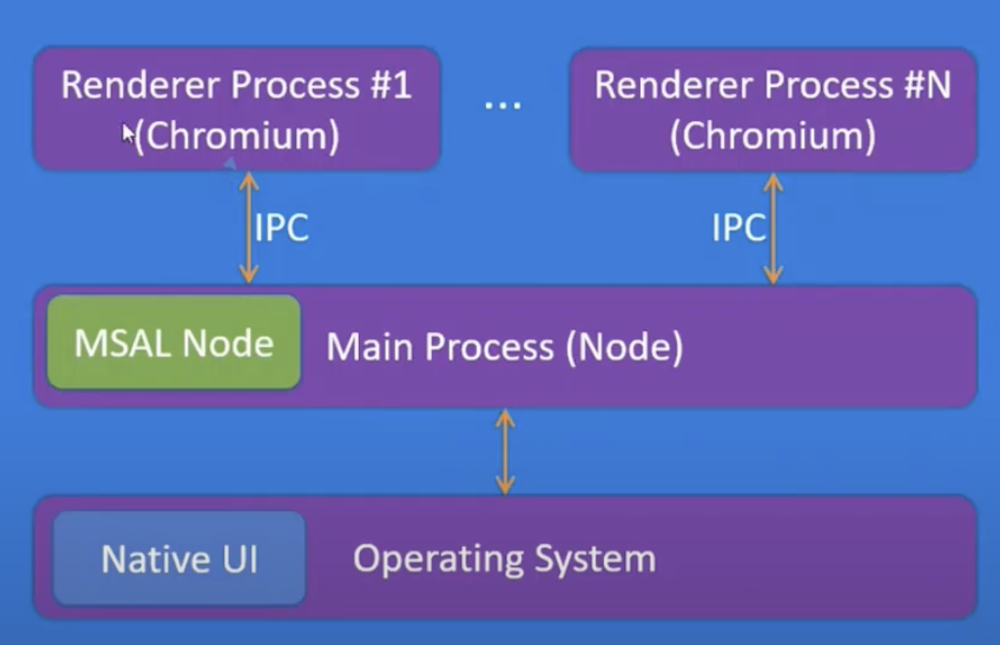

# Electron Auth

Let's try Electron Auth following [Electron documentation](https://www.electronjs.org/docs/latest/).

## Goals

- Implement new brand icons ✅
- Test Auth0 + Azure App ✅
- Sign in button Electron - Auth0 webAuth without approval from Admin ✅
- Sign in button Electron - Auth0 webAuth with Admin approval ✅ (no need)
- Sign in button Electron - PCKE without approval from Admin
- Sign in button Electron - PCKE with approval from Admin
- Auto login: Test Java to discover IWA + Electron
- Confirm Auto login without organization
- Confirm Auth login with organization
- Tray icon
- Test rebranding prebuilt apps based on this [doc](https://www.electronjs.org/docs/latest/tutorial/application-distribution)
- Signing Apps (Mac and Win)

## Resources

- [Icons with Electron Forge](https://www.electronforge.io/guides/create-and-add-icons#windows-and-macos)

## Discoveries

- `icon.icns` is used on Mac and `icon.ico` on Windows. So, please keep both
- The runtime icon on dev mode was not possible to be updated or the OS cache is more annoying than regular caches

- Electron has 2 different layers: Main Process (Node) and Rendering Process (could be many). There is a IPC to connect both layersl. Main Process has access to OS though.

- If the user has an active session with Azure AD and tries to sign-in to an app using MSAL, they may automatically sign-in without entering their credentials

- If the user has multiple active sessions with Azure AD, then the user is
  prompted to pick an account to sign in with
  • To bypass account selection screen, use a loginHint:
  • Session Id (sid)
  • login_hint (e.g. upn or preferred_username)
  • MSAL account object
